# Skills Marketplace Implementation Plan

> **For agentic workers:** REQUIRED SUB-SKILL: Use superpowers:subagent-driven-development (recommended) or superpowers:executing-plans to implement this plan task-by-task. Steps use checkbox (`- [ ]`) syntax for tracking.

**Goal:** Build the first repository-backed skills marketplace release for Codex and Claude Code with an adapted `Visual Brainstorming` skill.

**Architecture:** The repository has four small modules: a marketplace registry (`marketplace.json`), a skill package (`skills/visual-brainstorming/SKILL.md`), a local validator (`scripts/validate-marketplace.ps1`), and human-facing documentation (`README.md`). The registry is the machine-readable contract; the skill package is the shared source used by both tools; the validator checks JSON syntax and registry path integrity; the README explains how humans use and extend the marketplace.

**Tech Stack:** Markdown, JSON, PowerShell, Git. No package manager, CI, web UI, installer, or formal JSON Schema in this MVP.

---

## Architecture Plan

### Module Map
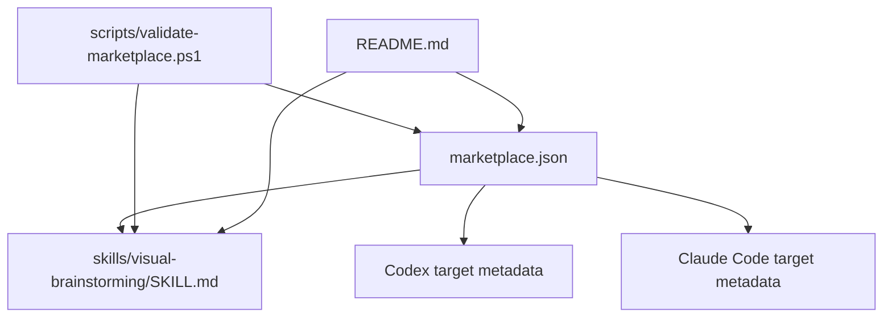

### Bounded Contexts
- **Marketplace Registry:** Owns skill identity, version, entrypoint, tags, and target compatibility.
- **Skill Package:** Owns reusable process instructions for `Visual Brainstorming`, including the new visual architecture-planning stage.
- **Validation:** Owns deterministic checks that the registry can be parsed and every listed skill resolves to a real `SKILL.md`.
- **Documentation:** Owns human installation and contribution guidance.

### Interfaces And Contracts
- `marketplace.json` must expose `schemaVersion` and `skills`.
- Each skill entry must expose `id`, `name`, `version`, `description`, `path`, `entrypoint`, `targets`, and `tags`.
- `targets.codex.compatible` and `targets.claudeCode.compatible` must be boolean values.
- `scripts/validate-marketplace.ps1` must exit non-zero on invalid JSON, missing required fields, missing skill files, duplicate ids, or incompatible target metadata.
- `README.md` must not define a second registry format; it must point back to `marketplace.json` as the source of truth.

### Domain Model
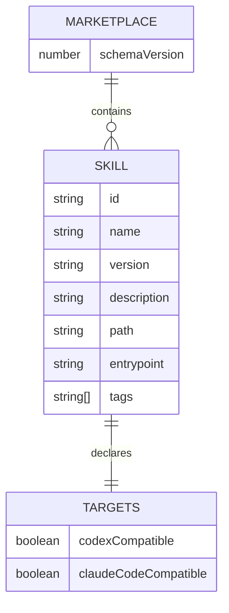

---

## File Structure

- Create: `scripts/validate-marketplace.ps1`
  - Responsibility: Validate the registry and skill file paths with built-in PowerShell only.
- Create: `marketplace.json`
  - Responsibility: Machine-readable marketplace index.
- Create: `skills/visual-brainstorming/SKILL.md`
  - Responsibility: First marketplace skill, adapted with an architecture-planning stage.
- Modify: `README.md`
  - Responsibility: Human-facing purpose, install guidance, and contribution rules.

---

### Task 1: Add Marketplace Validator

**Files:**
- Create: `scripts/validate-marketplace.ps1`

- [ ] **Step 1: Create the scripts directory**

Run:

```powershell
New-Item -ItemType Directory -Force -Path scripts | Out-Null
```

Expected: command exits with code `0`.

- [ ] **Step 2: Create the validator script**

Create `scripts/validate-marketplace.ps1` with this exact content:

```powershell
param(
    [string]$MarketplacePath = "marketplace.json"
)

$ErrorActionPreference = "Stop"

function Fail([string]$Message) {
    Write-Error $Message
    exit 1
}

if (-not (Test-Path -LiteralPath $MarketplacePath)) {
    Fail "Marketplace file not found: $MarketplacePath"
}

try {
    $marketplace = Get-Content -Raw -LiteralPath $MarketplacePath | ConvertFrom-Json
}
catch {
    Fail "Marketplace JSON is invalid: $($_.Exception.Message)"
}

if ($marketplace.schemaVersion -ne 1) {
    Fail "Expected schemaVersion 1."
}

$skills = @($marketplace.skills)
if ($skills.Count -lt 1) {
    Fail "Expected at least one skill entry."
}

$root = Split-Path -Parent (Resolve-Path -LiteralPath $MarketplacePath)
$ids = @{}
$requiredFields = @("id", "name", "version", "description", "path", "entrypoint", "targets", "tags")

foreach ($skill in $skills) {
    foreach ($field in $requiredFields) {
        if (-not $skill.PSObject.Properties.Name.Contains($field)) {
            Fail "Skill entry is missing required field '$field'."
        }
    }

    if ([string]::IsNullOrWhiteSpace($skill.id)) {
        Fail "Skill id must not be empty."
    }

    if ($ids.ContainsKey($skill.id)) {
        Fail "Duplicate skill id: $($skill.id)"
    }
    $ids[$skill.id] = $true

    if (-not $skill.targets.PSObject.Properties.Name.Contains("codex")) {
        Fail "Skill '$($skill.id)' is missing targets.codex."
    }
    if (-not $skill.targets.PSObject.Properties.Name.Contains("claudeCode")) {
        Fail "Skill '$($skill.id)' is missing targets.claudeCode."
    }
    if ($skill.targets.codex.compatible -isnot [bool]) {
        Fail "Skill '$($skill.id)' must set targets.codex.compatible to a boolean."
    }
    if ($skill.targets.claudeCode.compatible -isnot [bool]) {
        Fail "Skill '$($skill.id)' must set targets.claudeCode.compatible to a boolean."
    }

    $skillPath = Join-Path $root $skill.path
    $entrypointPath = Join-Path $skillPath $skill.entrypoint
    if (-not (Test-Path -LiteralPath $entrypointPath)) {
        Fail "Skill '$($skill.id)' entrypoint not found: $entrypointPath"
    }

    $skillText = Get-Content -Raw -LiteralPath $entrypointPath
    if ($skillText -notmatch "(?s)^---\s*\r?\n.*?\bname:\s*$([regex]::Escape($skill.id))\b.*?\r?\n---") {
        Fail "Skill '$($skill.id)' entrypoint frontmatter does not declare name: $($skill.id)."
    }
}

Write-Host "Marketplace validation passed ($($skills.Count) skills)."
```

- [ ] **Step 3: Run the validator and verify the expected failure**

Run:

```powershell
.\scripts\validate-marketplace.ps1
```

Expected: command exits non-zero with this message:

```text
Marketplace file not found: marketplace.json
```

- [ ] **Step 4: Commit the validator**

Run:

```powershell
git add scripts/validate-marketplace.ps1
git commit -m "Add marketplace validator"
```

Expected: commit succeeds.

---

### Task 2: Add Registry And Adapted Visual Brainstorming Skill

**Files:**
- Create: `marketplace.json`
- Create: `skills/visual-brainstorming/SKILL.md`

- [ ] **Step 1: Run the validator before adding the marketplace**

Run:

```powershell
.\scripts\validate-marketplace.ps1
```

Expected: command exits non-zero with:

```text
Marketplace file not found: marketplace.json
```

- [ ] **Step 2: Create the skill directory**

Run:

```powershell
New-Item -ItemType Directory -Force -Path skills\visual-brainstorming | Out-Null
```

Expected: command exits with code `0`.

- [ ] **Step 3: Create `marketplace.json`**

Create `marketplace.json` with this exact content:

```json
{
  "schemaVersion": 1,
  "skills": [
    {
      "id": "visual-brainstorming",
      "name": "Visual Brainstorming",
      "version": "0.1.0",
      "description": "Diagram-first brainstorming, product specs, and DDD-oriented architecture planning for repo-backed changes.",
      "path": "skills/visual-brainstorming",
      "entrypoint": "SKILL.md",
      "targets": {
        "codex": {
          "compatible": true
        },
        "claudeCode": {
          "compatible": true
        }
      },
      "tags": [
        "brainstorming",
        "architecture",
        "ddd",
        "design",
        "mermaid",
        "specs"
      ]
    }
  ]
}
```

- [ ] **Step 4: Create the adapted skill**

Create `skills/visual-brainstorming/SKILL.md` with this exact content:

`````markdown
---
name: visual-brainstorming
description: Use when the user wants to brainstorm, scope, design, or specify a feature/change with visual decision support, Mermaid diagrams, diagram-first specs, DDD-oriented architecture planning, module boundaries, interfaces, domain models, workflows, data flows, state changes, UI structure, or docs/superpowers/specs design documents.
---

# Visual Brainstorming

## Overview

Use this as an orchestration skill. It keeps `superpowers:brainstorming` as the authoritative design process, creates an isolated git worktree for repo-backed specs, then adds a visual layer: Mermaid diagrams by default for decisions, specs, and architecture plans, and the browser visual companion only for UI layout mockups.

The goal is not prettier documentation. The goal is shared understanding: decisions should be easier to inspect, dependencies should be visible, the written spec should be skimmable without losing precision, and the architecture should be explicit before implementation tasks are written.

## Required Base Process

**REQUIRED SUB-SKILL FOR REPO WORK:** Use `superpowers:using-git-worktrees` before creating or updating a spec in a git repository.

**REQUIRED DESIGN SUB-SKILL:** Use `superpowers:brainstorming` as the primary design process.

If this session will create or update a design spec in a repository, set up an isolated worktree before project context exploration and before writing the spec. Work in that worktree for the full spec and architecture-planning cycle so the work can be reviewed and merged back cleanly.

Skip worktree setup only when:

- The task is pure conversation and will not create or update repo files.
- The current directory is not a git repository.
- The user explicitly declines worktree isolation.
- You are already inside a suitable isolated worktree for this exact spec.

When skipping, say why briefly.

Follow all gates from `superpowers:brainstorming`:

- Explore project context before proposing changes.
- Ask one question at a time.
- Propose 2-3 approaches before settling.
- Present design sections and get user approval.
- Write the design doc to the expected spec location.
- Run spec self-review.
- Ask the user to review the written spec before moving to architecture planning.

After the user approves the written spec, add the architecture-planning stage described below. Do not jump directly from spec approval to implementation planning.

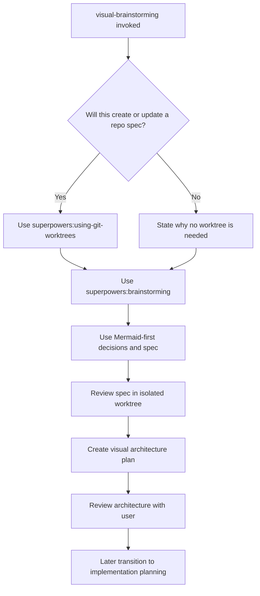

## Visual Decision Rule

When asking the user for a decision, use Mermaid by default if the question involves relationships, order, ownership, data, state, trade-offs, or dependencies.

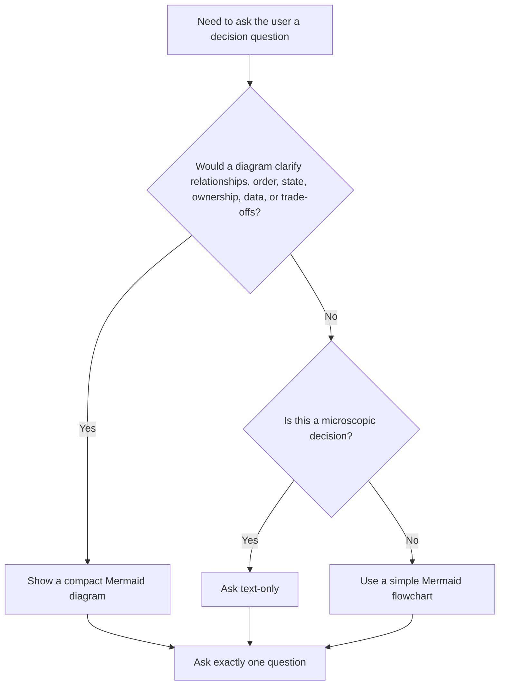

For each visual decision prompt:

1. Show the smallest useful Mermaid diagram.
2. Explain the options briefly.
3. Give your recommended answer.
4. Ask exactly one question.

Do not create diagrams that merely decorate the question. A useful diagram shows a dependency, sequence, boundary, state, data relationship, or choice.

## Browser Companion Rule

Use Mermaid as the default visual medium.

Use the `superpowers:brainstorming` browser visual companion only for UI layout mockups, side-by-side screen compositions, visual hierarchy, spacing, or other questions where the user needs to see a rendered interface.

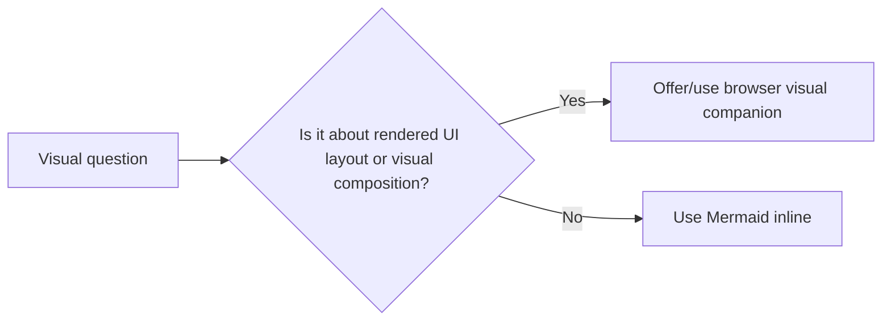

If the browser companion is used, still keep Mermaid for architecture, flow, state, and spec documentation.

## Decision-Tree Interview Pattern

Borrow the useful part of `grill-me`: resolve dependent decisions deliberately.

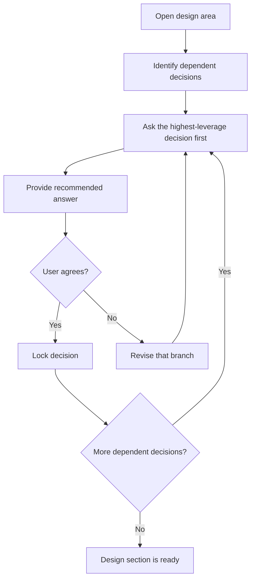

Be thorough, but not adversarial. The tone is collaborative: make hidden branches visible, recommend a path, and let the user steer.

## Diagram-First Spec Requirements

When `superpowers:brainstorming` reaches **Write design doc**, write a diagram-first Markdown spec. Mermaid is required by default.

The product/business spec should focus on:

- Business goal and user value.
- User-visible flow.
- Data shown to or collected from the user.
- Functional requirements and constraints.
- Behavioral decisions and rejected alternatives.
- User-facing error handling.
- Testing strategy at the behavior level.

Do not overload the spec with module boundaries, low-level implementation tasks, or detailed internal contracts. Those belong in the Architecture Plan.

Every spec should normally include:

- **System or component overview** using `flowchart`.
- **Main workflow** using `flowchart` or `sequenceDiagram`.
- **State, data, or error model** when relevant using `stateDiagram-v2`, `erDiagram`, `flowchart`, or `sequenceDiagram`.
- **Implementation sequence** only when it clarifies rollout or dependency order without replacing the later implementation plan.

For microscopic changes, one compact diagram is enough. Omit Mermaid only when a diagram would add no clarity. If omitting Mermaid, include a short `Diagram Omitted` section explaining why.

## Spec Template

Use this structure unless the base brainstorming process or user preference requires a different format:

````markdown
# [Design Name]

## Summary
[Short description of the approved design.]

## Non-Goals
[What this deliberately does not include.]

## Visual Model

### System Overview
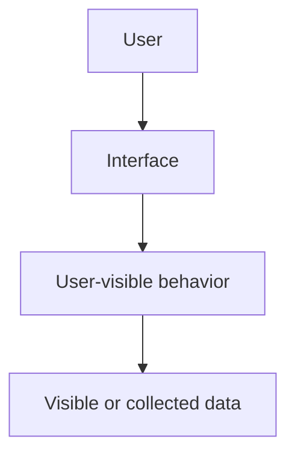

### Main Flow
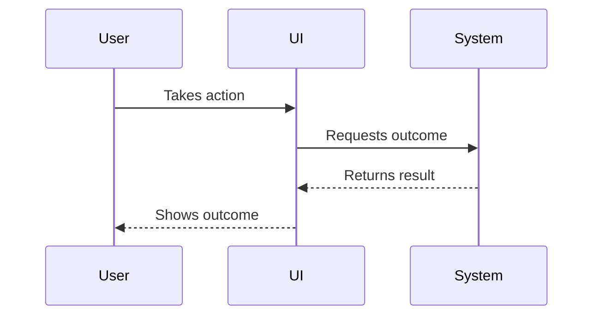

## Requirements
[Functional requirements and constraints.]

## Design Decisions
[Approved decisions, rejected alternatives, and rationale.]

## Error Handling
[Failure modes and expected user-visible behavior.]

## Testing Strategy
[Focused tests for the product behavior.]
````

## Architecture Planning Stage

After the user approves the written spec, create a separate visual architecture plan before invoking `superpowers:writing-plans`.

The architecture plan translates the approved product intent into technical shape. It should answer: what modules or bounded contexts exist, which ones change, what interfaces connect them, what domain concepts and data models matter, and what UI/component hierarchy is relevant.

For existing systems, do not document the entire architecture unless the change requires it. Focus on new or modified modules, contexts, interfaces, domain models, and data models.

The architecture plan is not the implementation plan. It should define boundaries and contracts, not a step-by-step task list.

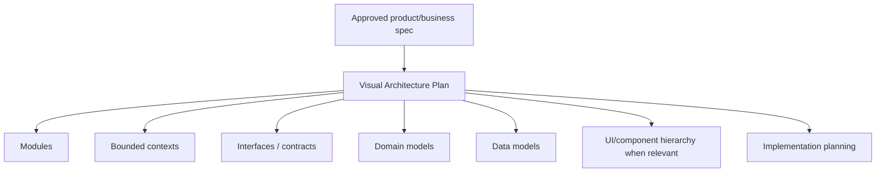

## Architecture Plan Requirements

A normal architecture plan should include:

- **Module Map:** new and modified modules, with ownership boundaries.
- **Bounded Context Map:** domain contexts and their relationships when the domain is non-trivial.
- **Interfaces / Contracts:** public functions, service boundaries, events, API shapes, or component props that connect modules.
- **Domain Model:** aggregates, entities, value objects, domain services, or important concepts when useful.
- **Data Model:** persisted data, external data, view models, DTOs, or user-visible data structures when relevant.
- **UI / Component Hierarchy:** for UI work, a Mermaid component tree or interaction diagram.
- **Architecture Decisions:** trade-offs, rejected boundaries, and why the selected shape fits the spec.
- **Architecture Testing Notes:** what boundaries or contracts need focused tests later.

Use Mermaid by default:

- `flowchart` for modules, components, ownership, and dependencies.
- `sequenceDiagram` for cross-context interactions.
- `erDiagram` for data models.
- `classDiagram` for interfaces or domain model relationships when it is clearer than prose.
- `stateDiagram-v2` for stateful domain or UI behavior.

For microscopic changes where architecture would add no clarity, include:

````markdown
## Architecture Plan Omitted
This change does not introduce or modify meaningful module boundaries, interfaces, domain models, data models, or component hierarchy. The approved spec is sufficient for implementation planning.
````

## Architecture Plan Template

Use this structure unless the project clearly needs a smaller version:

````markdown
# [Design Name] Architecture Plan

## Summary
[How the approved spec maps to technical structure.]

## Visual Architecture

### Module Map
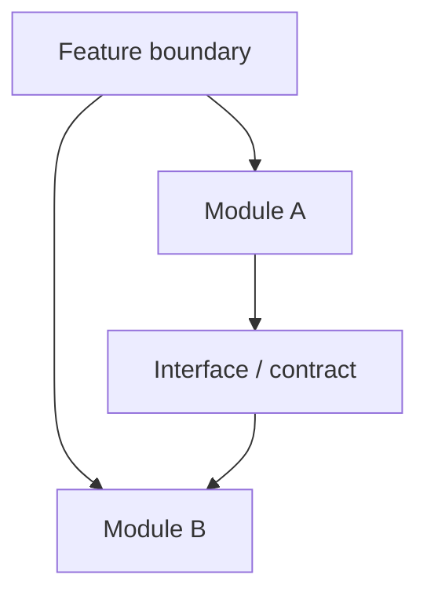

### Bounded Contexts
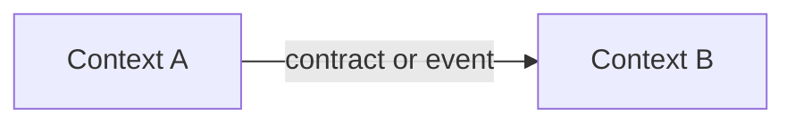

### Data Or Domain Model
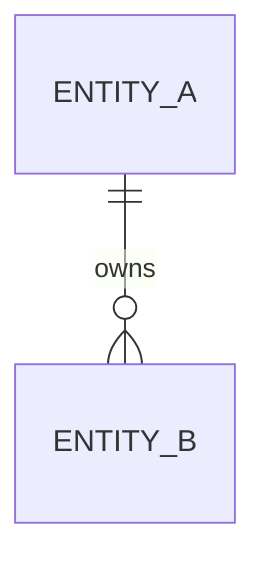

## Modules And Responsibilities
[New and modified modules only.]

## Interfaces And Contracts
[Public boundaries, inputs, outputs, ownership, and stability expectations.]

## Domain And Data Models
[Domain concepts and data structures that matter for the implementation.]

## UI / Component Structure
[Only when the work includes UI or component design.]

## Architecture Decisions
[Approved decisions and rejected alternatives.]

## Testing Implications
[Boundary, contract, and model tests that the implementation plan should include.]
````

## Architecture Self-Review

Before asking the user to approve the architecture plan, check:

- Every module in a diagram has a stated responsibility.
- Every interface or contract has an owner, inputs, and outputs.
- Existing-system changes identify what is new, modified, or untouched.
- Domain terms are consistent with the product spec.
- Diagrams do not imply implementation tasks that the text omits.
- The plan is not a task checklist; detailed tasks are deferred to `superpowers:writing-plans`.

Fix issues inline before asking the user to review the architecture plan.

After the user approves the architecture plan, invoke `superpowers:writing-plans` to create the implementation plan.

## Spec Self-Review Additions

In addition to the `superpowers:brainstorming` self-review, check:

- Every diagrammed component is explained in text.
- Every major written workflow appears in a diagram.
- Arrows represent meaningful relationships.
- Diagrams do not contradict requirements, error handling, data flow, or testing sections.
- Mermaid syntax is valid enough to render in common Markdown viewers.
- The spec does not contain the detailed architecture plan; architecture is handled after spec approval.

Fix issues inline before asking the user to review the spec.

## Common Mistakes

| Mistake | Correction |
|---------|------------|
| Replacing `superpowers:brainstorming` | Use it as the base process and preserve its gates. |
| Jumping from spec approval straight to implementation planning | Create and review the visual architecture plan first. |
| Turning the architecture plan into a task checklist | Keep it to boundaries, contracts, models, and diagrams. |
| Asking several visual questions at once | Show one diagram, ask one question. |
| Using browser visuals for architecture | Use Mermaid for architecture, data, workflow, and state. |
| Creating decorative diagrams | Only diagram relationships, order, boundaries, states, data, or trade-offs. |
| Writing a text-heavy spec with one token diagram | Put the visual model near the top and make it explain the design. |
| Skipping Mermaid for normal features | Mermaid is the default; skip only for truly microscopic changes and explain why. |
`````

- [ ] **Step 5: Run the validator and verify success**

Run:

```powershell
.\scripts\validate-marketplace.ps1
```

Expected:

```text
Marketplace validation passed (1 skills).
```

- [ ] **Step 6: Commit registry and skill**

Run:

```powershell
git add marketplace.json skills/visual-brainstorming/SKILL.md
git commit -m "Add visual brainstorming marketplace skill"
```

Expected: commit succeeds.

---

### Task 3: Update README

**Files:**
- Modify: `README.md`

- [ ] **Step 1: Confirm current README is minimal**

Run:

```powershell
Get-Content -Raw README.md
```

Expected:

```text
# skills-library
```

- [ ] **Step 2: Replace README with marketplace documentation**

Replace `README.md` with this exact content:

````markdown
# Skills Library

Repository-backed skills marketplace for Codex and Claude Code.

The marketplace is intentionally small: skill folders live in `skills/`, and the top-level `marketplace.json` file is the machine-readable index. The first published skill is `Visual Brainstorming`.

## Available Skills

| Skill | Version | Targets | Description |
| --- | --- | --- | --- |
| Visual Brainstorming | 0.1.0 | Codex, Claude Code | Diagram-first brainstorming, product specs, and DDD-oriented architecture planning for repo-backed changes. |

## Repository Structure

```text
marketplace.json
skills/
  visual-brainstorming/
    SKILL.md
scripts/
  validate-marketplace.ps1
docs/
  superpowers/
    specs/
    plans/
```

## Install A Skill

This MVP is file-based. Clone this repository or download the skill folder, then copy the selected skill folder into the local skills directory used by your agent.

For `Visual Brainstorming`, copy:

```text
skills/visual-brainstorming
```

The skill entrypoint is:

```text
skills/visual-brainstorming/SKILL.md
```

## Validate The Marketplace

Run:

```powershell
.\scripts\validate-marketplace.ps1
```

Expected:

```text
Marketplace validation passed (1 skills).
```

The validator checks that `marketplace.json` parses, required fields exist, Codex and Claude Code compatibility flags are present, and every skill entry points to a real `SKILL.md`.

## Add A Skill

1. Create a new folder under `skills/<skill-id>/`.
2. Add `SKILL.md` with frontmatter whose `name` matches `<skill-id>`.
3. Add a new entry to `marketplace.json`.
4. Include both target compatibility flags:

```json
"targets": {
  "codex": {
    "compatible": true
  },
  "claudeCode": {
    "compatible": true
  }
}
```

5. Run `.\scripts\validate-marketplace.ps1`.

## First Skill: Visual Brainstorming

`Visual Brainstorming` orchestrates visual, Mermaid-first discovery for repo-backed changes. This marketplace version adds an architecture-planning stage after the product/business spec is approved and before implementation planning begins.

The architecture stage focuses on module boundaries, bounded contexts, interfaces, domain models, data models, and UI/component hierarchy when relevant.
````

- [ ] **Step 3: Run README checks**

Run:

```powershell
Select-String -Path README.md -Pattern "Codex", "Claude Code", "Visual Brainstorming", "validate-marketplace.ps1", "Architecture"
```

Expected: the command prints matches for all five terms.

- [ ] **Step 4: Run the validator again**

Run:

```powershell
.\scripts\validate-marketplace.ps1
```

Expected:

```text
Marketplace validation passed (1 skills).
```

- [ ] **Step 5: Commit README update**

Run:

```powershell
git add README.md
git commit -m "Document skills marketplace"
```

Expected: commit succeeds.

---

### Task 4: Final Verification

**Files:**
- Read: `marketplace.json`
- Read: `skills/visual-brainstorming/SKILL.md`
- Read: `README.md`
- Read: `scripts/validate-marketplace.ps1`

- [ ] **Step 1: Verify working tree status**

Run:

```powershell
git status --short --branch
```

Expected: branch is `codex/skills-marketplace-spec` and there are no uncommitted changes.

- [ ] **Step 2: Validate marketplace**

Run:

```powershell
.\scripts\validate-marketplace.ps1
```

Expected:

```text
Marketplace validation passed (1 skills).
```

- [ ] **Step 3: Parse JSON independently**

Run:

```powershell
Get-Content -Raw marketplace.json | ConvertFrom-Json | Select-Object -ExpandProperty schemaVersion
```

Expected:

```text
1
```

- [ ] **Step 4: Confirm registry points to the skill entrypoint**

Run:

```powershell
$m = Get-Content -Raw marketplace.json | ConvertFrom-Json
$skill = @($m.skills)[0]
Test-Path (Join-Path $skill.path $skill.entrypoint)
```

Expected:

```text
True
```

- [ ] **Step 5: Confirm architecture-planning stage is present**

Run:

```powershell
Select-String -Path skills\visual-brainstorming\SKILL.md -Pattern "Architecture Planning Stage", "bounded contexts", "Interfaces / Contracts", "Domain Model", "After the user approves the architecture plan"
```

Expected: the command prints matches for all five patterns.

- [ ] **Step 6: Manual skill pressure review**

Read `skills/visual-brainstorming/SKILL.md` and check this prompt mentally against the workflow:

```text
I want to add a customer-facing dashboard to an existing app. Help me design it and then prepare an implementation plan.
```

Expected behavior:

1. The skill uses project-context exploration and brainstorming.
2. It produces a product/business spec focused on goal, flow, visible data, behavior, and tests.
3. It asks the user to review the written spec.
4. It produces a visual architecture plan with modules, bounded contexts, interfaces, models, and component hierarchy.
5. It asks the user to review the architecture.
6. It only then invokes `superpowers:writing-plans`.

- [ ] **Step 7: Review final commits**

Run:

```powershell
git log --oneline -5
```

Expected: recent commits include:

```text
Document skills marketplace
Add visual brainstorming marketplace skill
Add marketplace validator
Add architecture planning stage to marketplace spec
Add skills marketplace design spec
```
