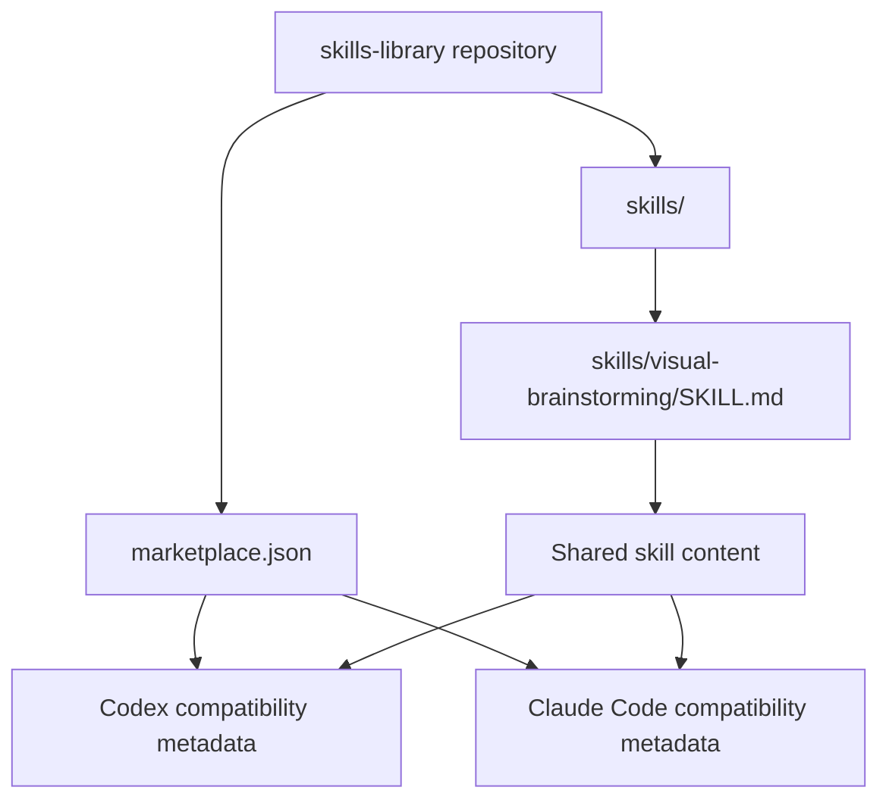
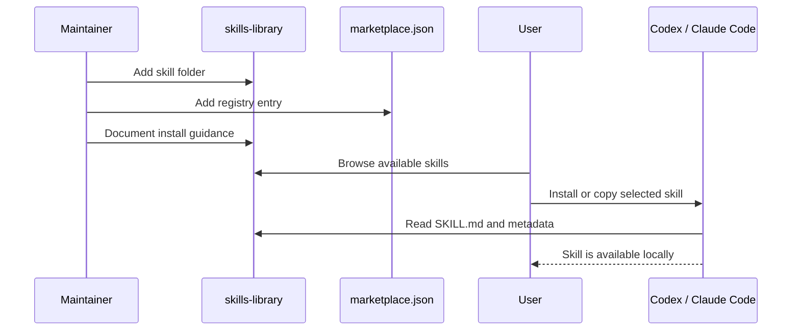
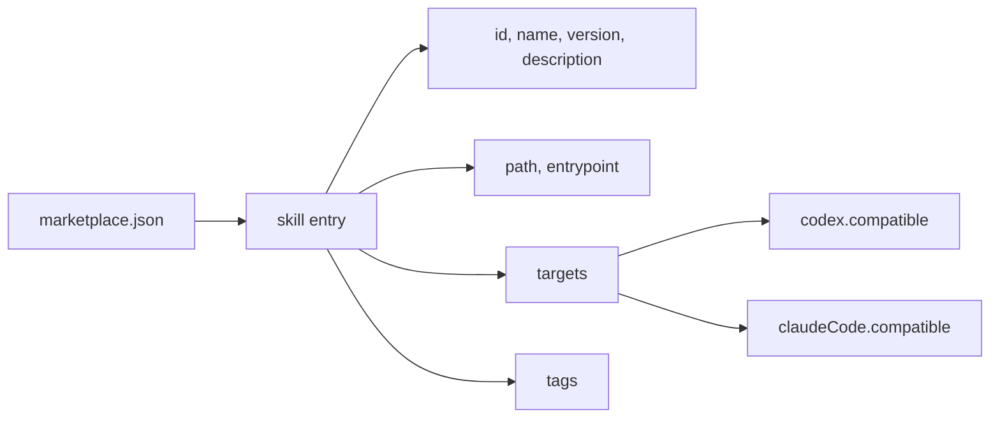
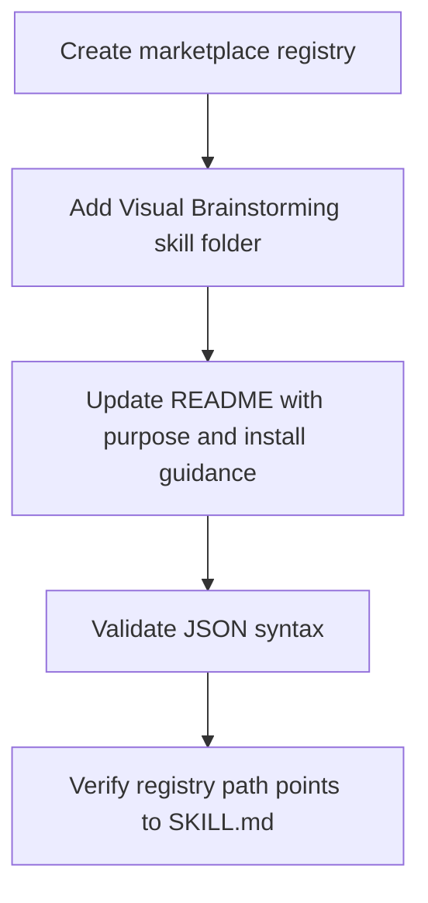

# Skills Marketplace Design

## Summary
Create a small, repository-backed skills marketplace for Codex and Claude Code. The first published skill will be `Visual Brainstorming`. The repository will use a shared skill directory as the source of truth, plus a `marketplace.json` registry that records metadata, paths, versions, tags, and compatibility with both tools.

The MVP is intentionally file-based: users browse the repository, inspect the registry, and copy or install skill folders through their own local tooling. Installer scripts, a web catalog, and full schema validation can come later after the registry shape has proven useful.

## Non-Goals
- Build a web marketplace UI.
- Build an automatic installer.
- Publish packages to an external registry.
- Add CI or a formal JSON Schema in the first release.
- Split Codex and Claude Code into separate skill source trees.

## Visual Model

### System Overview

### Main Flow

### Registry Model

### Implementation Sequence

## Requirements
- The repository must contain a top-level `marketplace.json`.
- `marketplace.json` must use `schemaVersion: 1`.
- `marketplace.json` must include a `visual-brainstorming` skill entry.
- Each skill entry must include `id`, `name`, `version`, `description`, `path`, `entrypoint`, `targets`, and `tags`.
- `targets.codex.compatible` and `targets.claudeCode.compatible` must both be present for the first skill.
- The first skill must live at `skills/visual-brainstorming/SKILL.md`.
- `README.md` must explain the marketplace purpose, the first skill, the file-based install model, and how to add future skills.
- The MVP must be understandable without custom tooling.

## Design Decisions

### Shared Source Tree
Use one shared `skills/` tree rather than separate Codex and Claude Code copies. This keeps the first marketplace small and prevents divergence between equivalent skill content.

### Single Registry File
Use a single top-level `marketplace.json` as the first registry format. Per-tool adapter files are deferred until either Codex or Claude Code needs metadata that does not fit the shared model.

### File-Based Installation
Start with repository/file-based installation. A user can clone the repository or copy `skills/visual-brainstorming` into their local skills directory. This avoids designing an installer before the registry format is validated by real use.

### Version 0.1.0 For First Skill
Publish `Visual Brainstorming` as `0.1.0` because this repository is a new distribution channel even though the source skill already exists elsewhere.

## Error Handling
- If `marketplace.json` is invalid JSON, the release is not ready.
- If a registry `path` or `entrypoint` points to a missing file, the release is not ready.
- If a target is omitted, readers should treat compatibility as unknown rather than compatible.
- If Codex and Claude Code later need different packaging behavior, add explicit adapter metadata instead of duplicating the skill content.

## Testing Strategy
- Parse `marketplace.json` with a standard JSON parser.
- Check that every skill entry resolves to an existing `SKILL.md`.
- Manually inspect `README.md` for install instructions and future-skill contribution guidance.
- Manually inspect `skills/visual-brainstorming/SKILL.md` to confirm it has the expected skill frontmatter and body.

## MVP Deliverables
- `marketplace.json`
- `skills/visual-brainstorming/SKILL.md`
- Updated `README.md`
- Basic validation through JSON parsing and path existence checks
