# Visual Brainstorming

## Overview

Use this as an orchestration skill. It keeps `superpowers:brainstorming` as the authoritative design process, creates an isolated git worktree for repo-backed specs, then adds a visual layer: Mermaid diagrams by default for decisions, specs, and architecture plans, and the browser visual companion only for UI layout mockups.

The goal is not prettier documentation. The goal is shared understanding: decisions should be easier to inspect, dependencies should be visible, the written spec should be skimmable without losing precision, and the architecture should be explicit before implementation tasks are written.

## Required Base Process

**REQUIRED SUB-SKILL FOR REPO WORK:** Use `superpowers:using-git-worktrees` before creating or updating a spec in a git repository.

**REQUIRED DESIGN SUB-SKILL:** Use `superpowers:brainstorming` as the primary design process.

If this session will create or update a design spec in a repository, set up an isolated worktree before project context exploration and before writing the spec. Work in that worktree for the full spec and architecture-planning cycle so the work can be reviewed and merged back cleanly.

Skip worktree setup only when:

- The task is pure conversation and will not create or update repo files.
- The current directory is not a git repository.
- The user explicitly declines worktree isolation.
- You are already inside a suitable isolated worktree for this exact spec.

When skipping, say why briefly.

Follow all gates from `superpowers:brainstorming`:

- Explore project context before proposing changes.
- Ask one question at a time.
- Propose 2-3 approaches before settling.
- Present design sections and get user approval.
- Write the design doc to the expected spec location.
- Run spec self-review.
- Ask the user to review the written spec before moving to architecture planning.

After the user approves the written spec, add the architecture-planning stage described below. Do not jump directly from spec approval to detailed implementation planning.

Treat clear spec approval as an immediate transition trigger. If the user says the written spec is approved, accepted, good, OK, LGTM, "zaakceptowane", "zatwierdzam", or otherwise clearly confirms the spec, start the Architecture Planning Stage in the same turn when possible. Do not ask "what next?" after spec approval. Briefly acknowledge the approval, then create or begin the visual architecture plan.

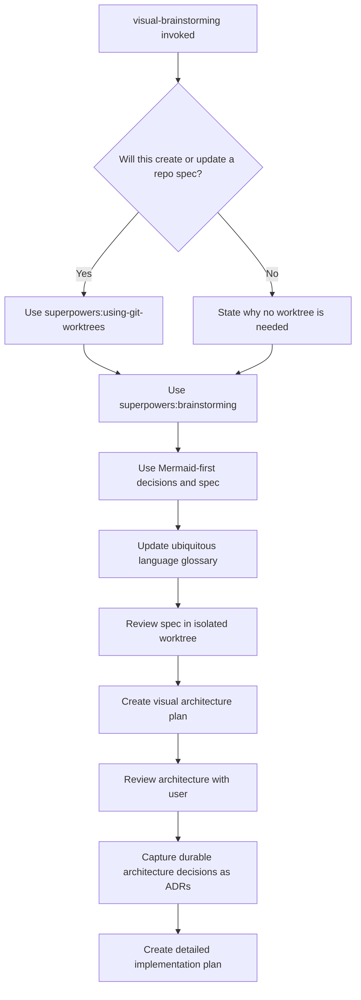

## Visual Decision Rule

When asking the user for a decision, use Mermaid by default if the question involves relationships, order, ownership, data, state, trade-offs, or dependencies.

Prefer vertical diagram layouts whenever practical. Use top-to-bottom flow (`flowchart TD` or `flowchart TB`) as the default because it is easier to scan in chat, Markdown previews, and narrow panes. Use horizontal layouts (`flowchart LR`) only when the diagram is naturally side-by-side and remains short. For longer diagrams, especially event storming, workflow, stateful process, and multi-step architecture diagrams, rewrite the model as a vertical flow or stacked groups instead of a long horizontal chain.

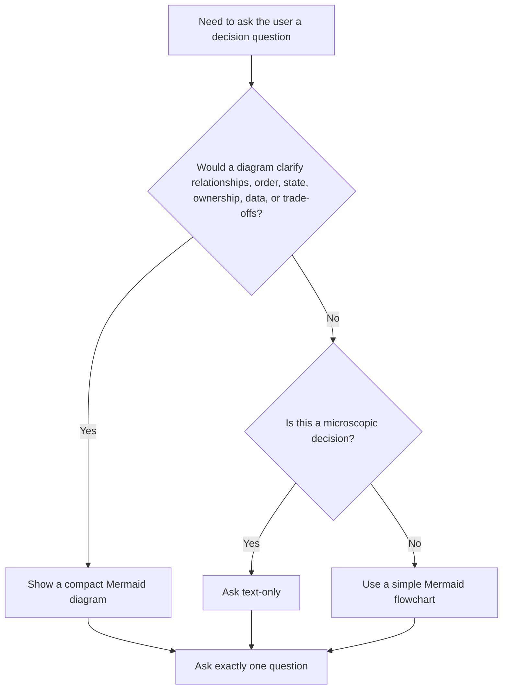

For each visual decision prompt:

1. Show the smallest useful Mermaid diagram.
2. Explain the options briefly.
3. Give your recommended answer.
4. Ask exactly one question.

Do not create diagrams that merely decorate the question. A useful diagram shows a dependency, sequence, boundary, state, data relationship, or choice.

## Browser Companion Rule

Use Mermaid as the default visual medium.

Use the `superpowers:brainstorming` browser visual companion only for UI layout mockups, side-by-side screen compositions, visual hierarchy, spacing, or other questions where the user needs to see a rendered interface.

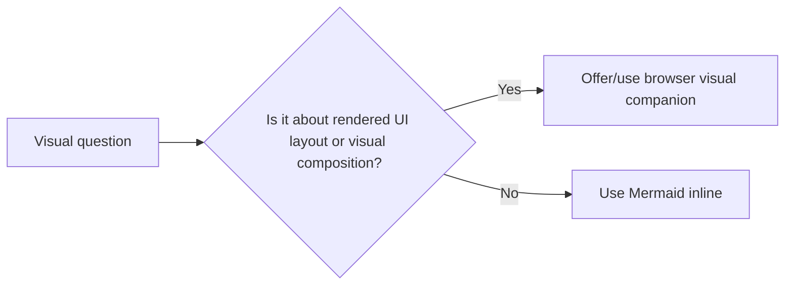

If the browser companion is used, still keep Mermaid for architecture, flow, state, and spec documentation.

## Decision-Tree Interview Pattern

Borrow the useful part of `grill-me`: resolve dependent decisions deliberately.

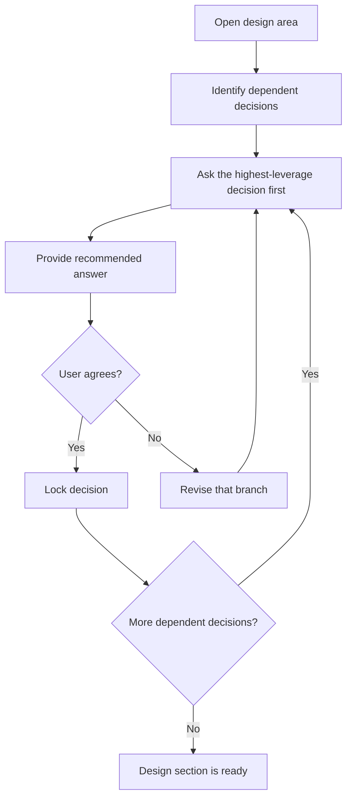

Be thorough, but not adversarial. The tone is collaborative: make hidden branches visible, recommend a path, and let the user steer.

## Diagram-First Spec Requirements

When `superpowers:brainstorming` reaches **Write design doc**, write a diagram-first Markdown spec. Mermaid is required by default.

The product/business spec should focus on:

- Business goal and user value.
- User-visible flow.
- Data shown to or collected from the user.
- Functional requirements and constraints.
- Behavioral decisions and rejected alternatives.
- User-facing error handling.
- Testing strategy at the behavior level.

Do not overload the spec with module boundaries, low-level implementation tasks, or detailed internal contracts. Those belong in the Architecture Plan.

Every spec should normally include:

- **System or component overview** using `flowchart`.
- **Main workflow** using `flowchart` or `sequenceDiagram`.
- **Event Storming Diagram** when the spec involves a workflow-heavy, asynchronous, event-driven, or domain-process-heavy change. This belongs in the product/business spec because it discovers behavior, commands, domain events, policies, read models, external systems, and hotspots before architecture is finalized.
- **Ubiquitous Language Updates** when the spec introduces, clarifies, renames, or disambiguates domain terms.
- **State, data, or error model** when relevant using `stateDiagram-v2`, `erDiagram`, `flowchart`, or `sequenceDiagram`.
- **Implementation sequence** only when it clarifies rollout or dependency order without replacing the later detailed implementation plan.

For microscopic changes, one compact diagram is enough. Omit Mermaid only when a diagram would add no clarity. If omitting Mermaid, include a short `Diagram Omitted` section explaining why.

## Spec Template

Use this structure unless the base brainstorming process or user preference requires a different format:

````markdown
# [Design Name]

## Summary
[Short description of the approved design.]

## Non-Goals
[What this deliberately does not include.]

## Visual Model

### System Overview
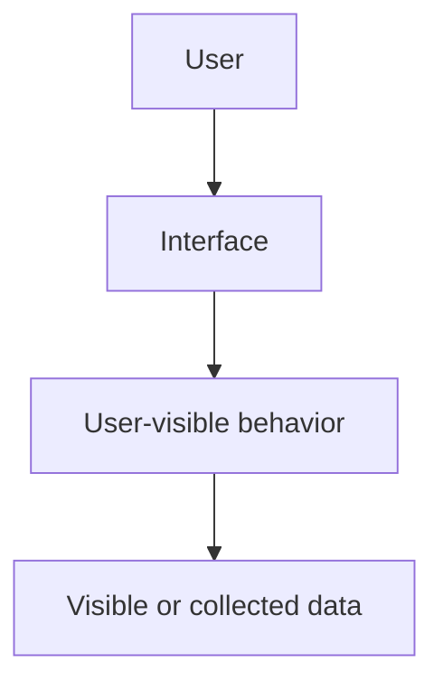

### Main Flow
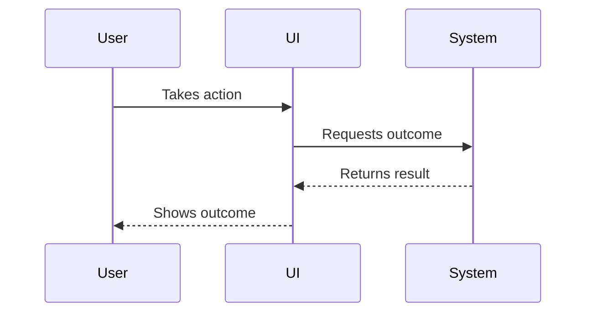

### Event Storming
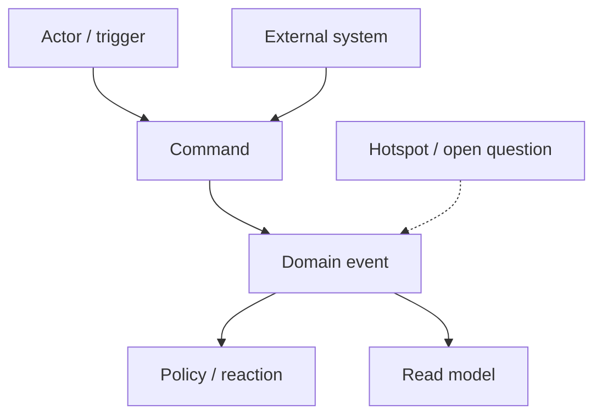

## Requirements
[Functional requirements and constraints.]

## Design Decisions
[Approved decisions, rejected alternatives, and rationale.]

## Ubiquitous Language Updates
[New or changed domain terms to add to `docs/architecture/ubiquitous-language.md`, or a brief note that no glossary update is needed.]

## Error Handling
[Failure modes and expected user-visible behavior.]

## Testing Strategy
[Focused tests for the product behavior.]
````

## Event Storming Facilitation

When event storming is relevant and the conversation does not already contain enough detail, act as a facilitator. Ask one focused question at a time to discover the domain process before writing the spec.

Use this discovery order:

1. Identify the main actors, external systems, and triggers.
2. List happy-path domain events in chronological order, using past-tense phrasing such as `Order was created`.
3. Add exception, failure, timeout, cancellation, and compensation events.
4. Map commands to events: actor/system -> command -> aggregate or process -> domain event.
5. Identify policies or reactions: when event X happens, what should the system or another actor do?
6. Identify read models, notifications, integrations, and hotspots or open questions.
7. Capture new or ambiguous terms for the Ubiquitous Language Rule.

If the user has already provided the needed process details, infer the event storming model from the conversation and show it for confirmation instead of re-asking obvious questions.

Prefer vertical Mermaid diagrams for event storming. Keep commands, events, policies, read models, external systems, and hotspots visibly distinct through node labels.

## Ubiquitous Language Rule

For repo-backed specs, maintain a shared Ubiquitous Language glossary whenever the brainstorming/spec process introduces, changes, renames, or disambiguates domain terms.

Default location: `docs/architecture/ubiquitous-language.md`. If the repo already has a clear glossary or ubiquitous language file under `docs/architecture/`, update the existing file instead of creating a duplicate. If `docs/architecture/` does not exist, create it.

The glossary is a durable architecture artifact. The feature spec owns "what we are building now"; the glossary owns the shared meaning of domain language over time.

Update the glossary during or immediately after writing the spec when:

- A new business/domain term appears.
- A term has different meanings in different contexts.
- A term is renamed, narrowed, broadened, or deprecated.
- Event storming reveals commands, events, actors, aggregates, policies, or read models that need stable names.
- A user correction clarifies what a term should or should not mean.

Do not add implementation-only names, small UI labels, one-off copy, obvious technical terms, or temporary placeholders unless they affect domain understanding.

Use this compact format:

```markdown
# Ubiquitous Language

This glossary defines shared domain terms used by specs, architecture plans, ADRs, and implementation work.

| Term | Context | Definition | Synonyms | Confusions / Antonyms | Related specs |
|------|---------|------------|----------|------------------------|---------------|
| Account | Identity | Login-capable user identity. | User account | Distinct from billing account. | `docs/superpowers/specs/...` |
```

When a glossary entry is added or changed, link the relevant spec in the `Related specs` column. In the spec, include a short `Ubiquitous Language Updates` section listing the terms changed and the glossary path.

## Architecture Planning Stage

After the user approves the written spec, create a separate visual architecture plan before invoking `superpowers:writing-plans`.

The architecture plan translates the approved product intent into technical shape. It should answer: what modules or bounded contexts exist, which ones change, what interfaces connect them, what domain concepts and data models matter, and what UI/component hierarchy is relevant.

For existing systems, do not document the entire architecture unless the change requires it. Focus on new or modified modules, contexts, interfaces, domain models, and data models.

The architecture plan is not the detailed implementation plan. It should define boundaries and contracts, not a step-by-step task list.

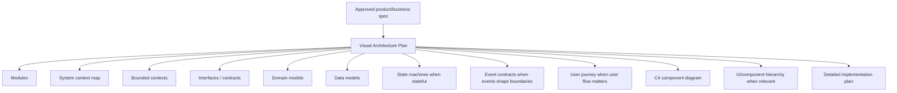

## Architecture Plan Requirements

A normal architecture plan should include:

- **System Context Map:** actors, external systems, platform boundaries, and integration touchpoints.
- **C4 Component Diagram:** containers/components involved in the change, with responsibilities and dependencies. Use a C4-style Mermaid `flowchart` when native C4 tooling is not available.
- **Module Map:** new and modified modules, with ownership boundaries.
- **Bounded Context Map:** domain contexts, ownership boundaries, upstream/downstream relationships, and context-map relationship types when useful.
- **Interfaces / Contracts:** public functions, service boundaries, events, API shapes, or component props that connect modules.
- **Domain Model:** aggregates, entities, value objects, domain services, or important concepts when useful.
- **Data Model:** persisted data, external data, view models, DTOs, or user-visible data structures when relevant.
- **State Machine Diagram:** required when the system, domain entity, workflow, UI, or integration has meaningful states or transitions.
- **Event Contracts:** when the approved spec includes event storming or event-driven behavior, identify which events cross module/context boundaries and who owns their contracts. Do not recreate the full event storming diagram here unless the spec omitted it and architecture cannot be understood without it.
- **User Journey Diagram:** required when user experience, onboarding, operational workflow, or multi-step user behavior materially affects the architecture.
- **UI / Component Hierarchy:** for UI work, a Mermaid component tree or interaction diagram.
- **Architecture Decisions:** trade-offs, rejected boundaries, and why the selected shape fits the spec.
- **Architecture Testing Notes:** what boundaries or contracts need focused tests later.

Use Mermaid by default:

- `flowchart` for modules, components, ownership, and dependencies.
- `sequenceDiagram` for cross-context interactions.
- `erDiagram` for data models.
- `classDiagram` for interfaces or domain model relationships when it is clearer than prose.
- `stateDiagram-v2` for stateful domain or UI behavior.
- `journey` for user journey diagrams when supported by the Markdown renderer; otherwise use `flowchart`.
- `flowchart TD` or `flowchart TB` for event storming diagrams in the product/business spec, grouping commands, events, policies, read models, external systems, and hotspots as vertical stages. Avoid long `flowchart LR` event-storming chains unless the whole diagram is very short.
- C4-style `flowchart` for component diagrams, naming actors, systems, containers, components, and relationships explicitly.

For microscopic changes where architecture would add no clarity, include:

````markdown
## Architecture Plan Omitted
This change does not introduce or modify meaningful module boundaries, interfaces, domain models, data models, or component hierarchy. The approved spec is sufficient for detailed implementation planning.
````

## Architecture Plan Template

Use this structure unless the project clearly needs a smaller version:

````markdown
# [Design Name] Architecture Plan

## Summary
[How the approved spec maps to technical structure.]

## Visual Architecture

### System Context Map
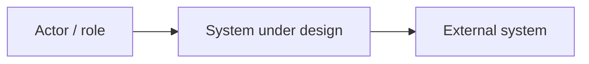

### C4 Component Diagram
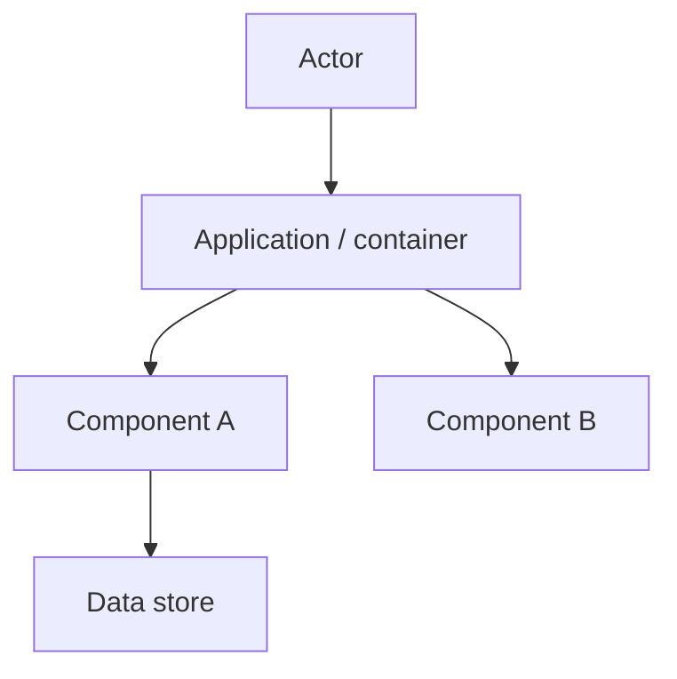

### Module Map
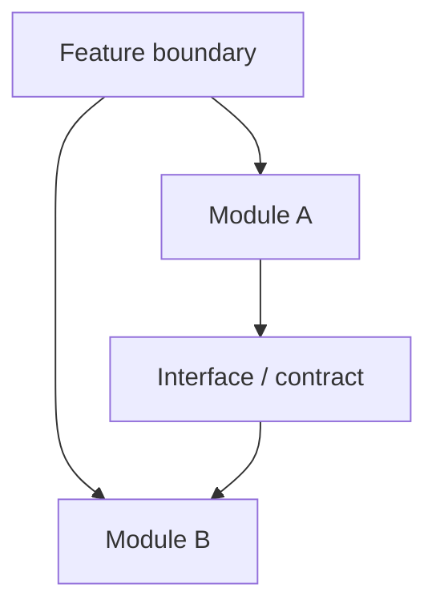

### Bounded Contexts
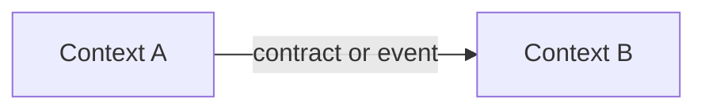

### State Machine
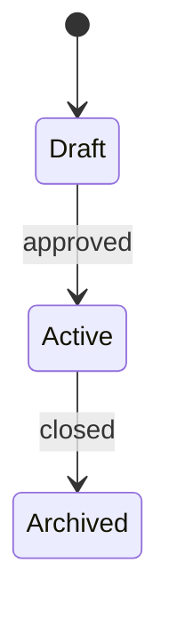

### User Journey
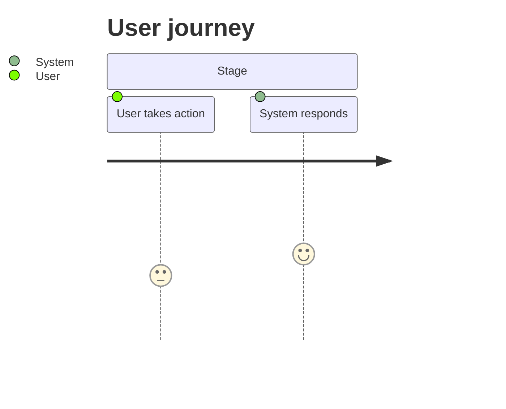

### Data Or Domain Model
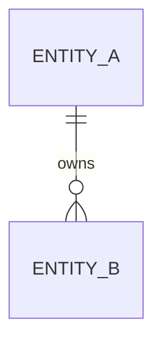

## Modules And Responsibilities
[New and modified modules only.]

## Context Map And Boundaries
[System context, bounded contexts, upstream/downstream relationships, ownership, and integration touchpoints.]

## Interfaces And Contracts
[Public boundaries, inputs, outputs, ownership, and stability expectations.]

## Domain And Data Models
[Domain concepts and data structures that matter for the implementation.]

## State, Event Contracts, And Journeys
[State machines, cross-boundary event contracts, and user journey implications. Reference the spec's event storming diagram when events shape architecture. Omit subsections only when they do not apply, and say why briefly.]

## UI / Component Structure
[Only when the work includes UI or component design.]

## Architecture Decisions
[Approved decisions and rejected alternatives.]

## Testing Implications
[Boundary, contract, and model tests that the detailed implementation plan should include.]
````

## Architecture Self-Review

Before asking the user to approve the architecture plan, check:

- Every module in a diagram has a stated responsibility.
- Every interface or contract has an owner, inputs, and outputs.
- The system context map identifies external actors, systems, and integration touchpoints.
- The bounded context map makes ownership and upstream/downstream relationships explicit when the domain is non-trivial.
- A C4 component diagram is present unless the change has no meaningful component-level architecture.
- A state machine diagram is present when any entity, workflow, integration, or UI has meaningful states; otherwise the omission is explained.
- If the spec includes event storming, cross-boundary event contracts are reflected here with owners and consumers; if event storming is needed but missing from the spec, pause and add it to the spec first.
- A user journey diagram is present when user experience or operational flow affects architecture; otherwise the omission is explained.
- Diagrams prefer vertical top-to-bottom flow where practical, and longer event-storming or workflow diagrams avoid hard-to-read horizontal chains.
- Existing-system changes identify what is new, modified, or untouched.
- Domain terms are consistent with the product spec and `docs/architecture/ubiquitous-language.md` when that glossary exists.
- Diagrams do not imply implementation tasks that the text omits.
- The architecture plan is not a task checklist; detailed tasks are deferred to `superpowers:writing-plans`.

Fix issues inline before asking the user to review the architecture plan.

After the user approves the architecture plan, apply the ADR Capture Rule below, then invoke `superpowers:writing-plans` to create the detailed implementation plan with task sequencing, file-level changes, tests, verification commands, checkpoints, and commits.

## ADR Capture Rule

When a repo-backed spec or architecture plan captures decisions with long-term architectural impact, create or update ADRs under `docs/adr/` before detailed implementation planning.

Be critical. Ask whether a decision is durable enough to deserve ADR capture. Prefer fewer, higher-signal ADRs over documentation noise.

Use ADRs for decisions that explain why the system should keep a shape over time: durable module boundaries, bounded contexts, integration patterns, persistence choices, identity/access models, event contracts, public APIs, cross-cutting policies, or constraints that future features should respect.

Do not create ADRs for small UI copy, validation details, implementation chores, reversible micro-decisions, or decisions that matter only inside the current feature. Keep feature specs as the place for "what we are building now". Keep ADRs as the place for "why the system should have this shape over time".

Do not create one ADR per tiny decision by default. Prefer one ADR per coherent decision cluster or bounded context. Create separate ADR files only when decisions can change independently, belong to different bounded contexts, or have separate review lifecycles.

If `docs/adr/` does not exist, create it with a short `README.md` explaining the convention and including an index of ADR files.

Use sequential filenames like `0001-client-self-service-identity-access.md`. Link the spec or architecture document to each ADR created or updated. In the ADR, link back to related specs and architecture plans.

If in doubt, keep the decision in the spec and mention that no ADR was created because the decision is not durable enough.

Use this ADR format:

```markdown
# ADR-0001: Decision Cluster Name

Status: Accepted

Date: YYYY-MM-DD

Related specs:

- `path/to/spec.md`
- `path/to/architecture.md`

## Context

Why this decision cluster exists.

## Decision

The linked architectural decisions.

## Consequences

Positive outcomes, trade-offs, and constraints.

## Alternatives Considered

Important rejected options and why they were rejected.

## Review Triggers

When this ADR should be revisited.
```

## Spec Self-Review Additions

In addition to the `superpowers:brainstorming` self-review, check:

- Every diagrammed component is explained in text.
- Every major written workflow appears in a diagram.
- Arrows represent meaningful relationships.
- Diagrams do not contradict requirements, error handling, data flow, or testing sections.
- Mermaid syntax is valid enough to render in common Markdown viewers.
- The spec does not contain the detailed architecture plan; architecture is handled after spec approval.
- New, changed, or ambiguous domain terms are reflected in the Ubiquitous Language glossary, or the spec explains why no glossary update is needed.

Fix issues inline before asking the user to review the spec.

## Common Mistakes

| Mistake | Correction |
|---------|------------|
| Replacing `superpowers:brainstorming` | Use it as the base process and preserve its gates. |
| Jumping from spec approval straight to detailed implementation planning | Create and review the visual architecture plan first. |
| Turning the architecture plan into a task checklist | Keep it to boundaries, contracts, models, and diagrams. |
| Asking several visual questions at once | Show one diagram, ask one question. |
| Using browser visuals for architecture | Use Mermaid for architecture, data, workflow, and state. |
| Creating decorative diagrams | Only diagram relationships, order, boundaries, states, data, or trade-offs. |
| Writing a text-heavy spec with one token diagram | Put the visual model near the top and make it explain the design. |
| Skipping Mermaid for normal features | Mermaid is the default; skip only for truly microscopic changes and explain why. |
