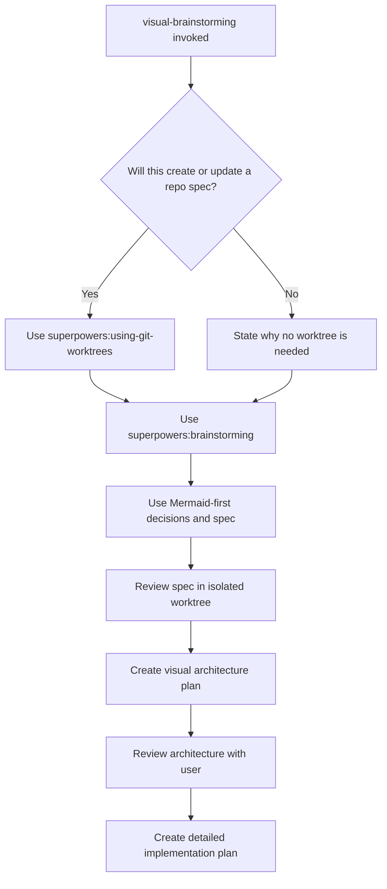
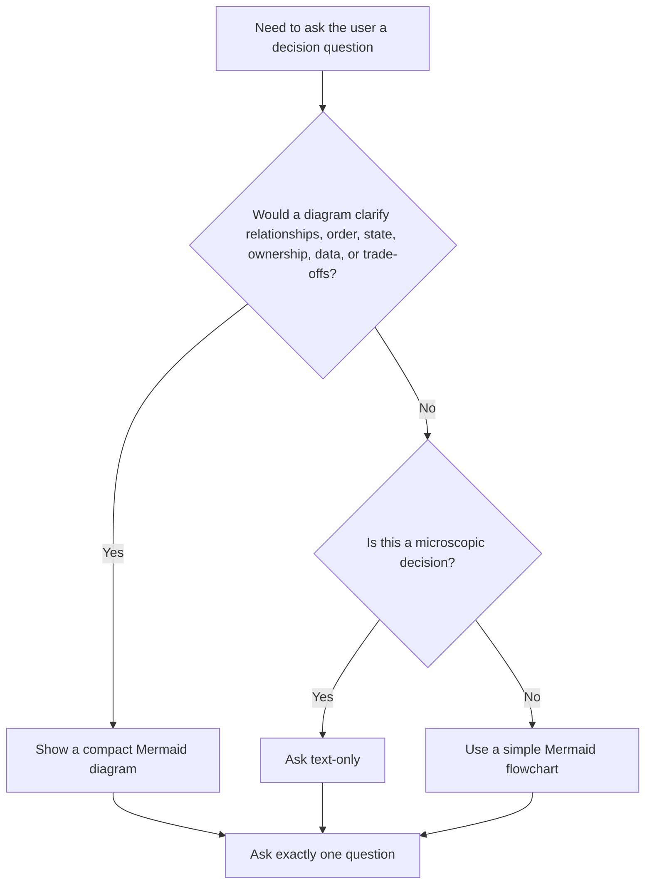
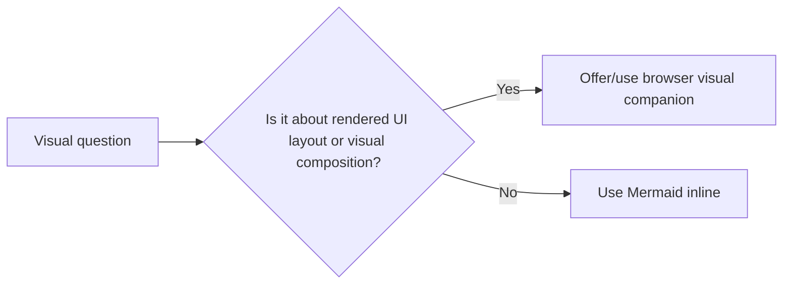
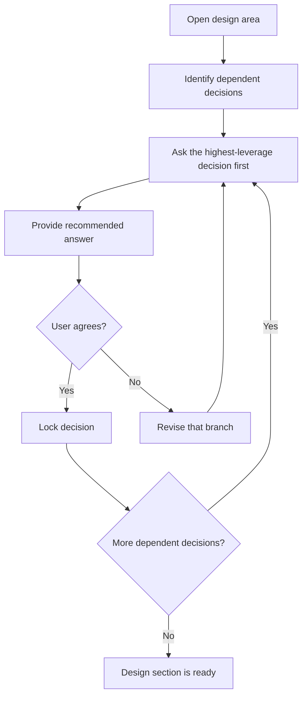
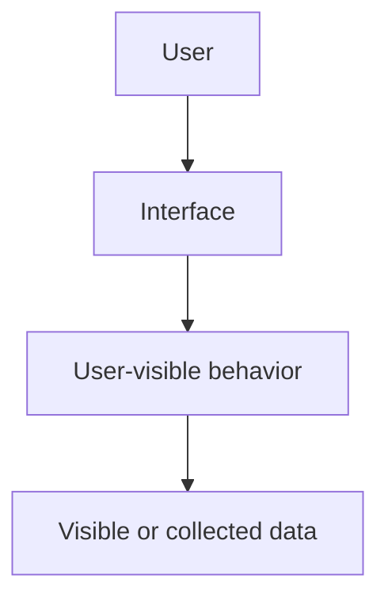
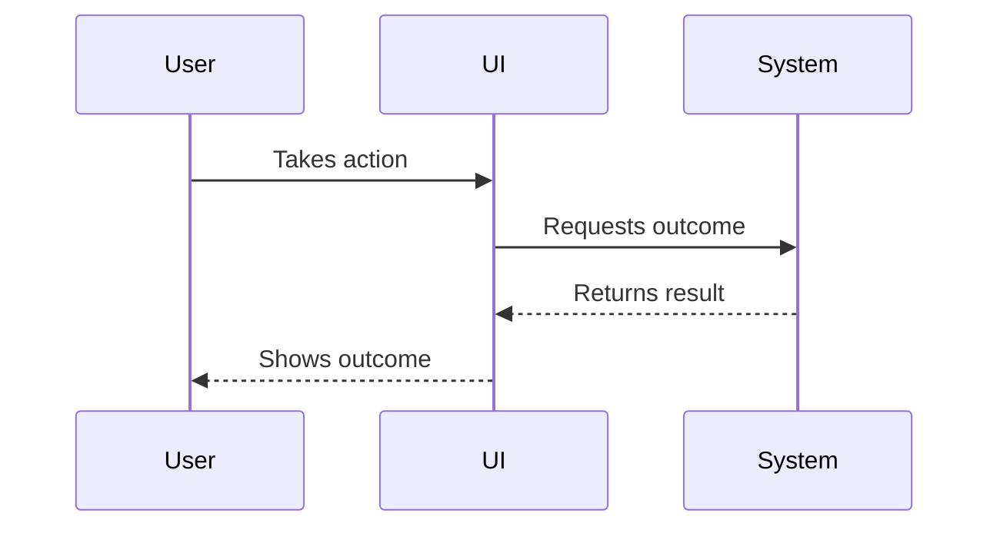
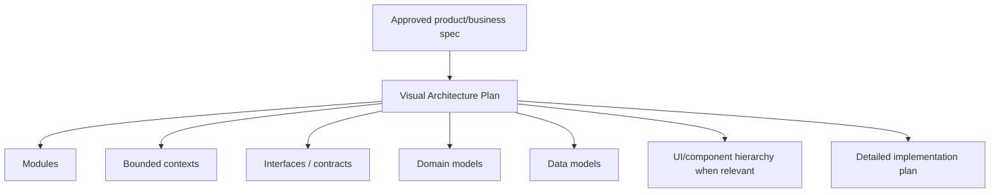
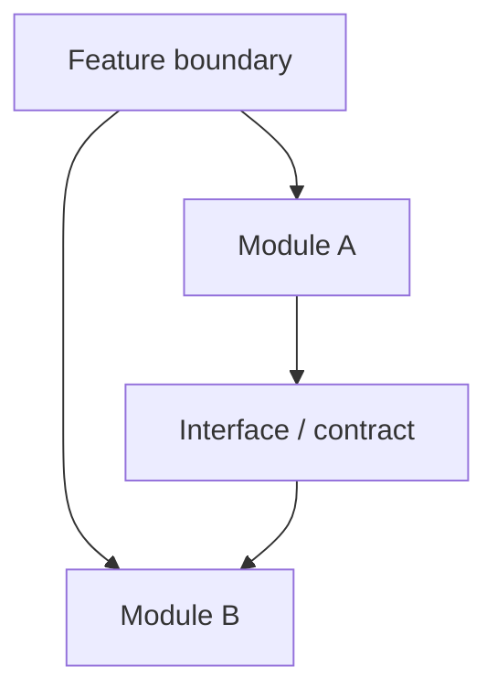
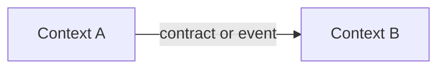
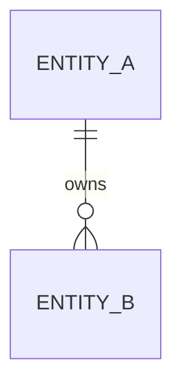

# Visual Brainstorming

## Overview

Use this as an orchestration skill. It keeps `superpowers:brainstorming` as the authoritative design process, creates an isolated git worktree for repo-backed specs, then adds a visual layer: Mermaid diagrams by default for decisions, specs, and architecture plans, and the browser visual companion only for UI layout mockups.

The goal is not prettier documentation. The goal is shared understanding: decisions should be easier to inspect, dependencies should be visible, the written spec should be skimmable without losing precision, and the architecture should be explicit before implementation tasks are written.

## Required Base Process

**REQUIRED SUB-SKILL FOR REPO WORK:** Use `superpowers:using-git-worktrees` before creating or updating a spec in a git repository.

**REQUIRED DESIGN SUB-SKILL:** Use `superpowers:brainstorming` as the primary design process.

If this session will create or update a design spec in a repository, set up an isolated worktree before project context exploration and before writing the spec. Work in that worktree for the full spec and architecture-planning cycle so the work can be reviewed and merged back cleanly.

Skip worktree setup only when:

- The task is pure conversation and will not create or update repo files.
- The current directory is not a git repository.
- The user explicitly declines worktree isolation.
- You are already inside a suitable isolated worktree for this exact spec.

When skipping, say why briefly.

Follow all gates from `superpowers:brainstorming`:

- Explore project context before proposing changes.
- Ask one question at a time.
- Propose 2-3 approaches before settling.
- Present design sections and get user approval.
- Write the design doc to the expected spec location.
- Run spec self-review.
- Ask the user to review the written spec before moving to architecture planning.

After the user approves the written spec, add the architecture-planning stage described below. Do not jump directly from spec approval to detailed implementation planning.



## Visual Decision Rule

When asking the user for a decision, use Mermaid by default if the question involves relationships, order, ownership, data, state, trade-offs, or dependencies.



For each visual decision prompt:

1. Show the smallest useful Mermaid diagram.
2. Explain the options briefly.
3. Give your recommended answer.
4. Ask exactly one question.

Do not create diagrams that merely decorate the question. A useful diagram shows a dependency, sequence, boundary, state, data relationship, or choice.

## Browser Companion Rule

Use Mermaid as the default visual medium.

Use the `superpowers:brainstorming` browser visual companion only for UI layout mockups, side-by-side screen compositions, visual hierarchy, spacing, or other questions where the user needs to see a rendered interface.



If the browser companion is used, still keep Mermaid for architecture, flow, state, and spec documentation.

## Decision-Tree Interview Pattern

Borrow the useful part of `grill-me`: resolve dependent decisions deliberately.



Be thorough, but not adversarial. The tone is collaborative: make hidden branches visible, recommend a path, and let the user steer.

## Diagram-First Spec Requirements

When `superpowers:brainstorming` reaches **Write design doc**, write a diagram-first Markdown spec. Mermaid is required by default.

The product/business spec should focus on:

- Business goal and user value.
- User-visible flow.
- Data shown to or collected from the user.
- Functional requirements and constraints.
- Behavioral decisions and rejected alternatives.
- User-facing error handling.
- Testing strategy at the behavior level.

Do not overload the spec with module boundaries, low-level implementation tasks, or detailed internal contracts. Those belong in the Architecture Plan.

Every spec should normally include:

- **System or component overview** using `flowchart`.
- **Main workflow** using `flowchart` or `sequenceDiagram`.
- **State, data, or error model** when relevant using `stateDiagram-v2`, `erDiagram`, `flowchart`, or `sequenceDiagram`.
- **Implementation sequence** only when it clarifies rollout or dependency order without replacing the later detailed implementation plan.

For microscopic changes, one compact diagram is enough. Omit Mermaid only when a diagram would add no clarity. If omitting Mermaid, include a short `Diagram Omitted` section explaining why.

## Spec Template

Use this structure unless the base brainstorming process or user preference requires a different format:

````markdown
# [Design Name]

## Summary
[Short description of the approved design.]

## Non-Goals
[What this deliberately does not include.]

## Visual Model

### System Overview


### Main Flow


## Requirements
[Functional requirements and constraints.]

## Design Decisions
[Approved decisions, rejected alternatives, and rationale.]

## Error Handling
[Failure modes and expected user-visible behavior.]

## Testing Strategy
[Focused tests for the product behavior.]
````

## Architecture Planning Stage

After the user approves the written spec, create a separate visual architecture plan before invoking `superpowers:writing-plans`.

The architecture plan translates the approved product intent into technical shape. It should answer: what modules or bounded contexts exist, which ones change, what interfaces connect them, what domain concepts and data models matter, and what UI/component hierarchy is relevant.

For existing systems, do not document the entire architecture unless the change requires it. Focus on new or modified modules, contexts, interfaces, domain models, and data models.

The architecture plan is not the detailed implementation plan. It should define boundaries and contracts, not a step-by-step task list.



## Architecture Plan Requirements

A normal architecture plan should include:

- **Module Map:** new and modified modules, with ownership boundaries.
- **Bounded Context Map:** domain contexts and their relationships when the domain is non-trivial.
- **Interfaces / Contracts:** public functions, service boundaries, events, API shapes, or component props that connect modules.
- **Domain Model:** aggregates, entities, value objects, domain services, or important concepts when useful.
- **Data Model:** persisted data, external data, view models, DTOs, or user-visible data structures when relevant.
- **UI / Component Hierarchy:** for UI work, a Mermaid component tree or interaction diagram.
- **Architecture Decisions:** trade-offs, rejected boundaries, and why the selected shape fits the spec.
- **Architecture Testing Notes:** what boundaries or contracts need focused tests later.

Use Mermaid by default:

- `flowchart` for modules, components, ownership, and dependencies.
- `sequenceDiagram` for cross-context interactions.
- `erDiagram` for data models.
- `classDiagram` for interfaces or domain model relationships when it is clearer than prose.
- `stateDiagram-v2` for stateful domain or UI behavior.

For microscopic changes where architecture would add no clarity, include:

````markdown
## Architecture Plan Omitted
This change does not introduce or modify meaningful module boundaries, interfaces, domain models, data models, or component hierarchy. The approved spec is sufficient for detailed implementation planning.
````

## Architecture Plan Template

Use this structure unless the project clearly needs a smaller version:

````markdown
# [Design Name] Architecture Plan

## Summary
[How the approved spec maps to technical structure.]

## Visual Architecture

### Module Map


### Bounded Contexts


### Data Or Domain Model


## Modules And Responsibilities
[New and modified modules only.]

## Interfaces And Contracts
[Public boundaries, inputs, outputs, ownership, and stability expectations.]

## Domain And Data Models
[Domain concepts and data structures that matter for the implementation.]

## UI / Component Structure
[Only when the work includes UI or component design.]

## Architecture Decisions
[Approved decisions and rejected alternatives.]

## Testing Implications
[Boundary, contract, and model tests that the detailed implementation plan should include.]
````

## Architecture Self-Review

Before asking the user to approve the architecture plan, check:

- Every module in a diagram has a stated responsibility.
- Every interface or contract has an owner, inputs, and outputs.
- Existing-system changes identify what is new, modified, or untouched.
- Domain terms are consistent with the product spec.
- Diagrams do not imply implementation tasks that the text omits.
- The architecture plan is not a task checklist; detailed tasks are deferred to `superpowers:writing-plans`.

Fix issues inline before asking the user to review the architecture plan.

After the user approves the architecture plan, invoke `superpowers:writing-plans` to create the detailed implementation plan with task sequencing, file-level changes, tests, verification commands, checkpoints, and commits.

## Spec Self-Review Additions

In addition to the `superpowers:brainstorming` self-review, check:

- Every diagrammed component is explained in text.
- Every major written workflow appears in a diagram.
- Arrows represent meaningful relationships.
- Diagrams do not contradict requirements, error handling, data flow, or testing sections.
- Mermaid syntax is valid enough to render in common Markdown viewers.
- The spec does not contain the detailed architecture plan; architecture is handled after spec approval.

Fix issues inline before asking the user to review the spec.

## Common Mistakes

| Mistake | Correction |
|---------|------------|
| Replacing `superpowers:brainstorming` | Use it as the base process and preserve its gates. |
| Jumping from spec approval straight to detailed implementation planning | Create and review the visual architecture plan first. |
| Turning the architecture plan into a task checklist | Keep it to boundaries, contracts, models, and diagrams. |
| Asking several visual questions at once | Show one diagram, ask one question. |
| Using browser visuals for architecture | Use Mermaid for architecture, data, workflow, and state. |
| Creating decorative diagrams | Only diagram relationships, order, boundaries, states, data, or trade-offs. |
| Writing a text-heavy spec with one token diagram | Put the visual model near the top and make it explain the design. |
| Skipping Mermaid for normal features | Mermaid is the default; skip only for truly microscopic changes and explain why. |
